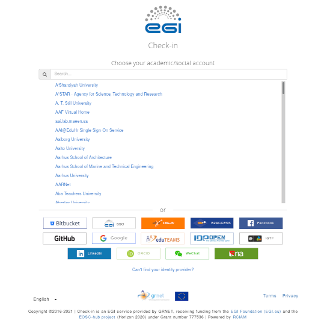

# EOSC-SYNERGY -- How to get Access

To get access to the infrastructure, you need to request membership in a
**Virtual Organisation**.  There, you will have to log in with your so called
Home Organisation. This is your university, recearch organisation or company
that you work for. 

You can choose your institution from a list.

If you do not find your institution on that list, your Organisation might not
yet support [eduGAIN](https://edugain.org). You can use one of the catch-all
Identitidy Providers:
    - ORCID
    - EGI-SSO
    - GitHub
    - Google
The important thing is that you need to remember the identity provider you used
for future sessions.

To become member of a VO, please go to the "Join here" link of the Virtual
Organisation to which you need access.

To request membership, please take a look at the [list of Virtual
Organisations](vos.md)

## Related Topics

- [List of Virtual Organisations](vos.md)
- [How to get Ressources](ressources_howto.md)
